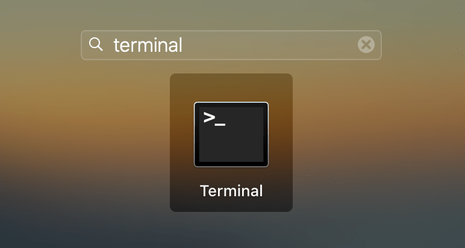
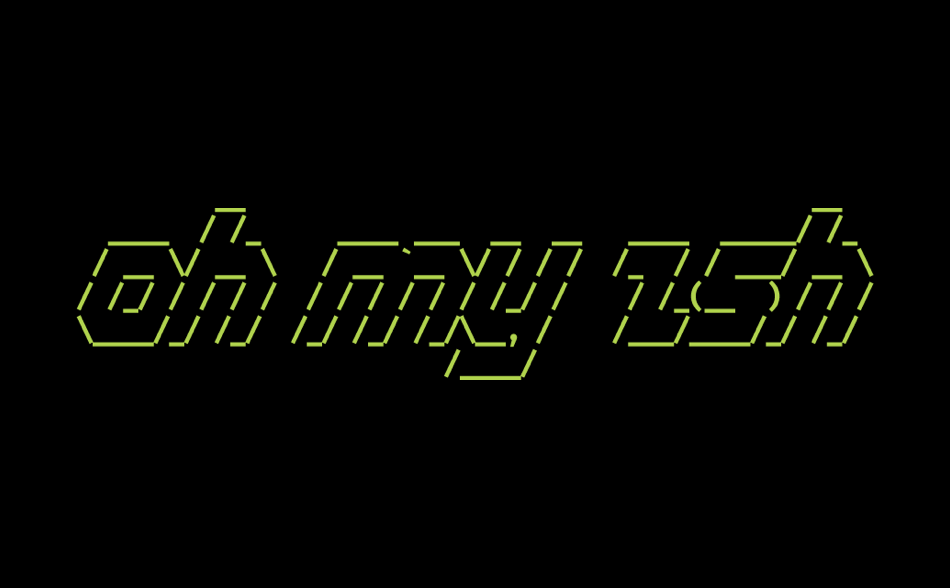
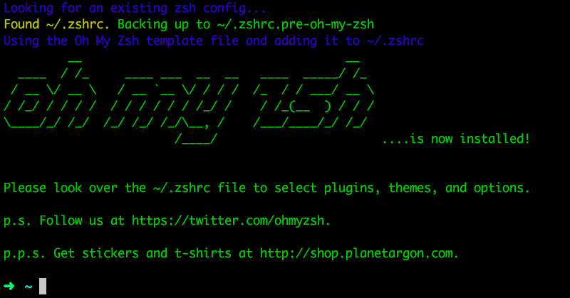
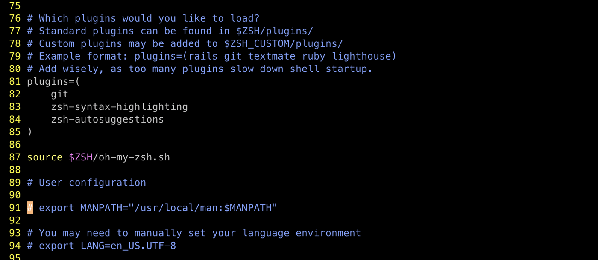
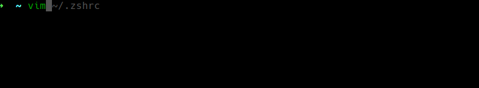
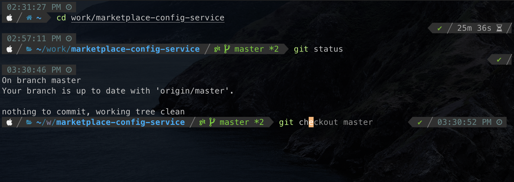

# How to put your Terminal on steroids?


I have always been a terminal enthusiast ever since I quit windows and this article is for those like me or people who want to fall in love with Terminal. The power to control almost anything on your computer just by typing commands on a black screen at a sheer typing speed.
Over a period of years, I kept looking for ways to make my experience with the terminal even more fun and time spent on it even more productive, the need for speed, and of course the need to make it more intuitive and good looking (The feeling to add colors to you B/W terminal is very fulfilling).
Scope

The scope of this article is to take you through a step-by-step guide to make your time spent on the terminal highly productive and to make it look zazzy (If you have seen The Big Bang Theory, you'll get it, otherwise you need to start watching better things on Netflix) and how I put my terminal on Steroids.
P.S. I prefer to use iterm2 over mac terminal.

### Zsh
Zsh a.k.a Z Shell is a highly extendible and customizable shell, with plenty of plugins and themes to choose from.
It ships with many out of the box features like:
Automatic 'cd' - just write the name of the directory.
Spell correction
Plugin and theme support

Refer to Zsh for instructions to install.
Once installed, you can switch/refresh zsh configs on your terminal using a simple command.

```
source ~/.zshrc
```

### Oh My Zsh

*Community-driven, open-source configuration manager for you Z Shell.*



Oh-My-Zsh is easy to install and makes it even easier to extend and manage plugins and various configurations of your Zsh.
```
curl -fsSL https://raw.githubusercontent.com/robbyrussell/oh-my-zsh/master/tools/install.sh | sh; zsh
```

This will install Oh-My-Zsh and update your .zshrc file with the required configurations.
Refer to Oh-My-Zsh for instructions to install.
If all goes right, you will see a screen now:



By now you already have a very powerful terminal with features like auto-complete, try typing a command eg git, and press TAB a couple of times, you can see all the suggestions and also cycle through them to select one.
To further add any plugins for your Zsh, you can simply install the desired plugins and add them in the .zshrc file.
```
vim ~/.zshrc
```


Let us focus on installing a couple of plugins for using our Zsh configurations and make it shine along with all the power we just gave to our terminal.
### Zsh-syntax-highlighting
It is a useful plugin that makes your typing highly fast and intuitive. It basically highlights the command green if typed right and red if typed incorrectly. It also underlines the existent directories/files.
To install, run the following command in your terminal:
```
git clone https://github.com/zsh-users/zsh-syntax-highlighting.git ${ZSH_CUSTOM:-~/.oh-my-zsh/custom}/plugins/zsh-syntax-highlighting
```

and then add `zsh-syntax-highlighting` in your plugins list.

```
plugins=(
    ...
    zsh-syntax-highlighting
    ...
)
```

Refer zsh-syntax-highlighting for instructions to install.
### Zsh-autosuggestions
It is a useful plugin to provide autocomplete suggestions based on your history.
To install, run the following command in your terminal:
git clone https://github.com/zsh-users/zsh-autosuggestions ${ZSH_CUSTOM:-~/.oh-my-zsh/custom}/plugins/zsh-autosuggestions
and then add `zsh-autosuggestions` in your plugins list.
```
plugins=(
    ...
    zsh-autosuggestions
    ...
)
```

Run the following command on the terminal to refresh changes.
```
source ~/.zshrc
```

Now you will have something like this when typing a command for the second time:



Refer zsh-autosuggestions for instructions to install.

### Powerlevel10k
Powerlevel10k is an interesting theme I came across to give a complete makeover to my terminal, in my case iTerm2. A theme that supports a lot of icons, changes the way your prompt looks, shows the current time, and even time to process a command. It doesn't stop there, it also saves you from many repetitive commands by giving you insight into your git-related info.
To install the theme manually:
```
git clone --depth=1 https://github.com/romkatv/powerlevel10k.git ~/powerlevel10k
echo 'source ~/powerlevel10k/powerlevel10k.zsh-theme' >>~/.zshrc
```
Restart Zsh.
Type `p10k configure` if the configuration wizard doesn't start automatically.
Refer Powerlevel10K for instructions to install.

### Conclusion
The list of features and plugins doesn't end here, there is always more that you can do, but after doing as much mentioned in this article, you can make your terminal intuitive, visually attractive, and be highly productive in your day-to-day tasks.
Have a look at my terminal on steroids.



Hit like if the article was helpful and have fun exploring and upgrading your workspace.